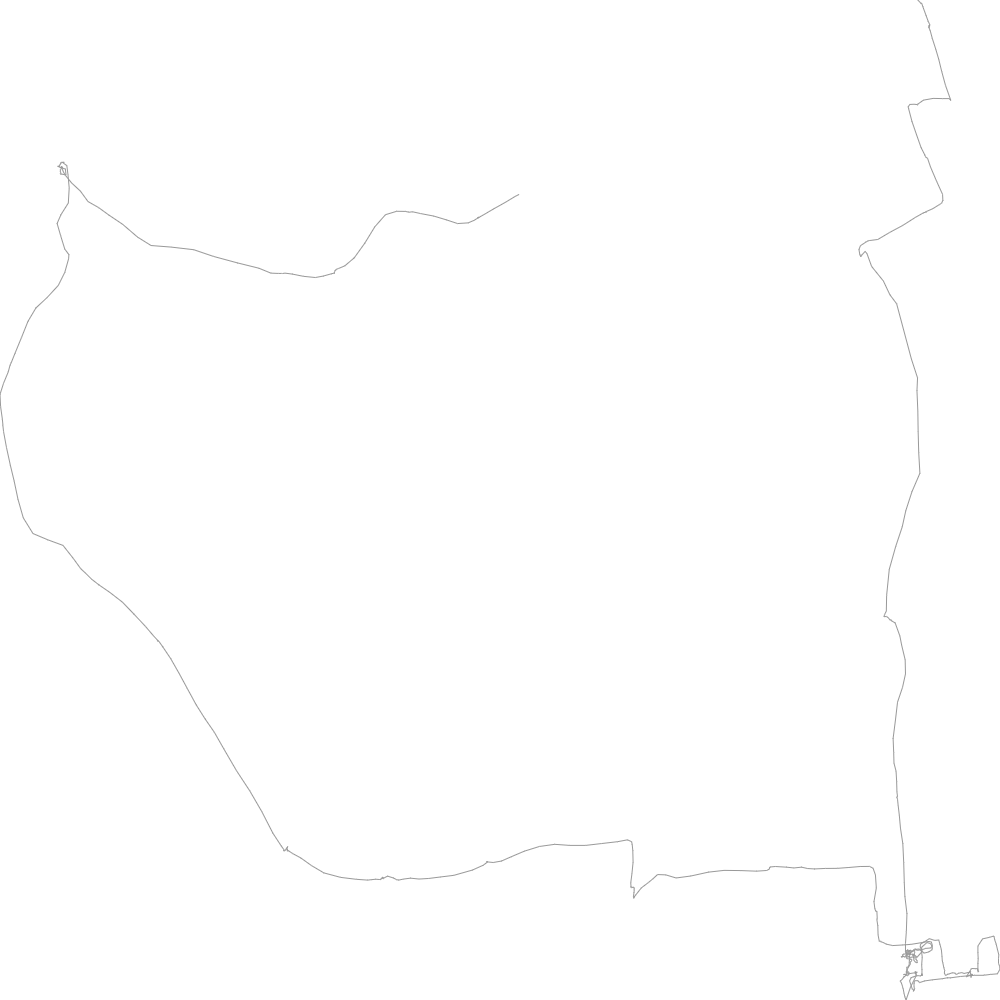

# server client drawing tool.
* client: draw image of car moving trajectory.
* manager: mock for send car coordinate to *server*.
* server: send coordinate to *client*.

Sample data was borrowed from [this site](http://www.ic.daito.ac.jp/~mizutani/gps/gps_visualizer.html).


## getting started
#### run server

```shell
$ yarn
$ yarn dev
```

#### open client

open http://localhost:5173

#### run manager

```shell
$ yarn mock
```